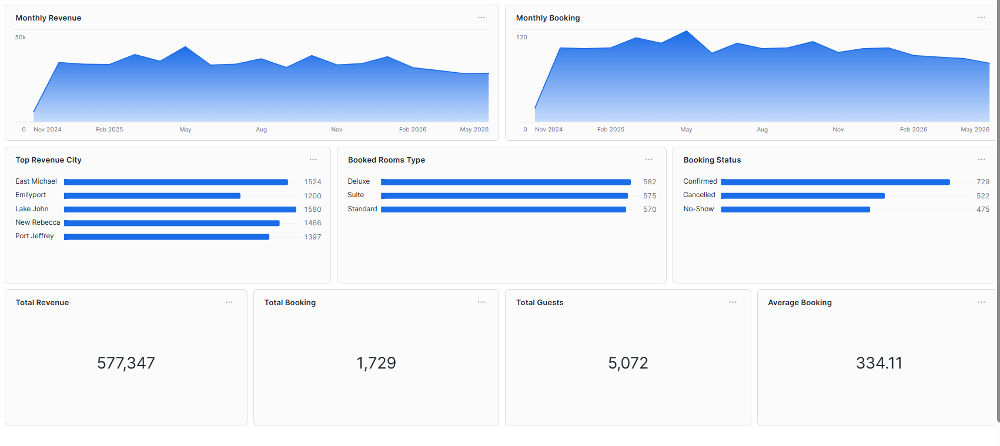

##### hotel-booking-data-analysis

- This project focuses on Hotel Booking Data Analysis using a modern data engineering approach with Bronze, Silver, and Gold layers in Snowflake.

#### The goal of this project is to:

- Ingest raw hotel booking data
- Clean and transform the data through structured layers
- Build analytical datasets
- Design an interactive dashboard for business insights

#### Architecture
This project follows the Medallion Architecture:

#### 🥉 Bronze Layer (Raw Data)

- Raw CSV data loaded directly into Snowflake
- Minimal transformation
- Preserves original data for traceability

#### 🥈 Silver Layer (Cleaned Data)

- Data cleaning and standardization
- Data type conversion (dates, numeric fields)
- Handling null values
- Removing duplicates

### 🥇 Gold Layer (Business-Ready Data)

- Aggregated and transformed datasets
- KPIs and metrics calculated
- Optimized for reporting and dashboard use

#### 🛠️ Technologies Used

- Snowflake (Data Warehouse)
- SQL
- CSV File Staging
- Snowflake Dashboard
- GitHub for version control

#### 1️⃣ Create Database

```bash
CREATE DATABASE HOTEL_DB;
USE DATABASE HOTEL_DB;
```

#### 2️⃣ Create File Format

```bash
CREATE OR REPLACE FILE FORMAT FF_CSV
    TYPE = 'CSV'
    FIELD_OPTIONALLY_ENCLOSED_BY = '"'
    SKIP_HEADER = 1
    NULL_IF = ('NULL', 'null', '');
```

#### 3️⃣ Create Stage

```bash
CREATE OR REPLACE STAGE STG_HOTEL_BOOKINGS
FILE_FORMAT = (FORMAT_NAME = FF_CSV);
```

#### 4️⃣ Create Bronze Table

```bash
CREATE TABLE BRONZE_HOTEL_BOOKING (
    booking_id STRING,
    hotel_id STRING,
    hotel_city STRING,
    customer_id STRING,
    customer_name STRING,
    customer_email STRING,
    check_in_date STRING,
    check_out_date STRING,
    room_type STRING,
    num_guests STRING,
    total_amount STRING,
    currency STRING,
    booking_status STRING
);
```

#### Data Pipeline Flow

-  Upload CSV file to Snowflake Stage
-  Load data into BRONZE_HOTEL_BOOKING
-  Transform and clean data into Silver layer
-  Create analytical tables in Gold layer
-  Connect BI tool to Gold layer
-  Build interactive dashboard


